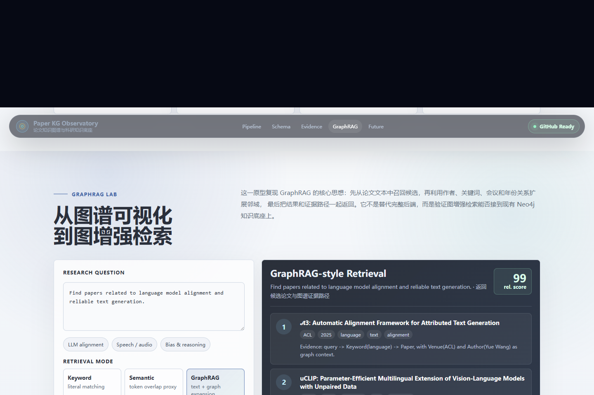

# Paper KG Observatory

Interactive showcase for a paper knowledge graph pipeline built around Neo4j, large-scale publication metadata, incremental updates, a static Web visualization, and a small GraphRAG-style retrieval prototype.

**Live demo:** https://zxccvv114514.github.io/paper-kg-showcase/




## Overview

Paper KG Observatory turns merged publication metadata into a graph-oriented research knowledge base. The pipeline extracts papers, authors, venues, years, keywords, and subjects from raw JSON records; normalizes entity identifiers; exports Neo4j-compatible CSV/Cypher artifacts; validates the imported graph locally; and provides a lightweight Web demo for exploring a sampled subgraph.

The current public demo also includes a browser-side GraphRAG Lab. It reproduces the core retrieval idea in a lightweight form: text recall first, graph-neighborhood expansion second, and evidence-path display third. The prototype is designed to test how a Neo4j paper graph can support research-oriented literature discovery beyond visual browsing.

The public demo uses sampled graph data only. The full graph and original datasets are not included in this repository.

## Highlights

- **107,200** validated paper nodes
- **154,144** author entities
- **103,366** keyword entities
- **~1.90M** core relationships
- Coverage across venues including INTERSPEECH, NeurIPS, AAAI, CVPR, ACL, EMNLP, ICML, and ICLR
- Static interactive visualization with search, filtering, zooming, node details, and neighborhood inspection
- GraphRAG-style retrieval prototype with keyword, semantic-proxy, and graph-enhanced modes

## Architecture

```text
Raw publication JSON
        |
        v
Field extraction and normalization
        |
        v
Stable ID matching and de-duplication
        |
        v
Graph schema construction
        |
        v
Neo4j CSV / Cypher export
        |
        v
Local Neo4j validation + sampled Web demo
```

## Graph Schema

Core node types:

- `Paper`
- `Author`
- `Venue`
- `Year`
- `Keyword`
- `Subject`

Core relationships:

- `(:Paper)-[:AUTHORED_BY {author_order}]->(:Author)`
- `(:Paper)-[:PUBLISHED_IN]->(:Venue)`
- `(:Paper)-[:PUBLISHED_YEAR]->(:Year)`
- `(:Paper)-[:HAS_KEYWORD]->(:Keyword)`
- `(:Paper)-[:HAS_SUBJECT]->(:Subject)`

The pipeline also includes DBLP XML citation-edge extraction and diagnostics, leaving room for future integration with richer citation sources such as OpenAlex, Semantic Scholar, Crossref, or OpenCitations.

## Demo Features

- Full-canvas graph visualization
- Venue-level filtering
- Node type filtering
- Keyword/title/author search
- Click-to-inspect node details
- Neighbor exploration
- GraphRAG Lab: question input, baseline comparison, graph-context scoring, and evidence-path output
- Responsive static deployment on GitHub Pages

## GraphRAG Reproduction Prototype

The GraphRAG Lab is a small, static reproduction layer over the sampled graph. It does not call an external LLM or embedding API. Instead, it keeps the public demo fully reproducible by using:

- token-based text recall over paper title, abstract, venue, year, authors, and keywords;
- a semantic-proxy baseline based on normalized token overlap;
- graph-enhanced scoring over `HAS_KEYWORD`, `AUTHORED_BY`, `PUBLISHED_IN`, and `PUBLISHED_YEAR` neighbors;
- evidence-path rendering that explains why each candidate paper was returned.

The same interface can be extended to the full local Neo4j graph with real embedding vectors, Cypher-based neighborhood retrieval, citation edges, and an LLM answer synthesis layer.

## Local Preview

```powershell
cd paper_kg_showcase
python -m http.server 8848 --bind 127.0.0.1
```

Then open:

```text
http://127.0.0.1:8848/
```

## Repository Contents

```text
paper_kg_showcase/
  index.html                  # Static interactive showcase
  assets/graph_data.js         # Sampled graph data for public demo
  README.md                    # Project overview
  REPRODUCTION_PLAN.md          # GraphRAG reproduction scope and next steps
  DEMO_SCRIPT.md               # Demo video script
  DEPLOY_GITHUB_PAGES.md       # Deployment notes
```

## Privacy Boundary

This repository intentionally excludes:

- Original large-scale metadata files
- Local Neo4j database files
- Credentials, database connection strings, and private paths
- Non-public research materials

Only sampled demo data and project documentation are included.
